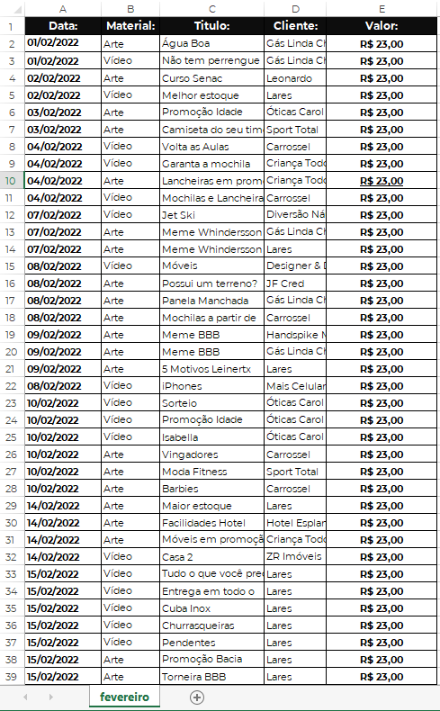
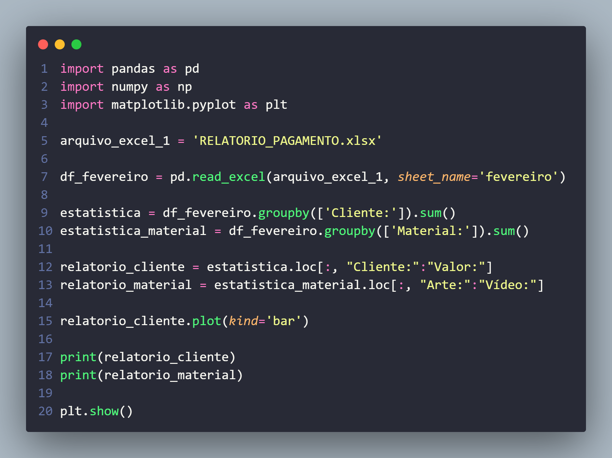
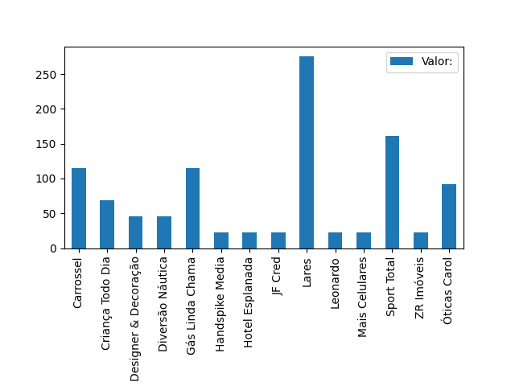
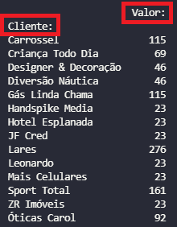

<h1 align='center'>Automatizando Relatórios com Pyhton 📈<h1>

## Trabalho em uma empresa de Marketing Digital, onde produzimos Artes e Vídeos para Instagram e Facebook de empresas.
## Usamos Excel na maior parte do tempo para fazer os relatórios da quantidade de materiais, e quanto de gastos cada cliente teve, desta forma:
  

  
## Porém, nosso maior problema era que, não tinhamos um parâmetro para saber qual cliente tinha a maior quantidade de gastos, qual tinha a menor quantidade de materiais, qual era a porcentagem de artes e vídeos e etc.
## Sabendo disso, criei um programa em Python com as bibliotecas Pandas, Numpy e Matplotlib.
  
  
## Esse programa vai ler o arquivo Excel, e vai criar um gráfico pra mim da quantidade de gastos que cada cliente teve:
  
  
## Além disso ele irá me mostrar no console: O nome do cliente e quanto de gasto esse cliente teve em R$:
 
  
## Ele também me mostra o valor total que tivemos com Artes e Vídeos em R$:
   
  
<h2>Bibliotecas utilizadas:</h3>

<table>
<tr>
<td>Pandas</td>
<td>Numpy</td>
<td>Matplotlib</td>
</tr>
